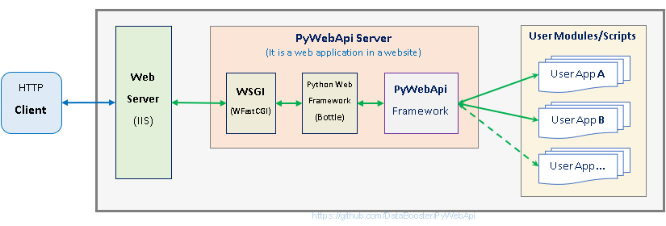
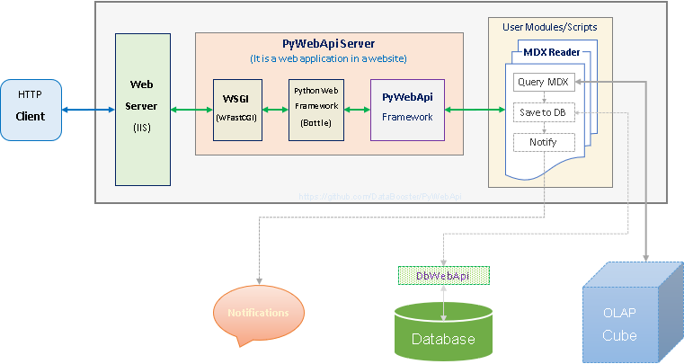

########
PyWebApi
########

PyWebApi is a micro-framework for Python RESTfulization. It turns Python(3+) modules/scripts into Web API (RESTful Service) out of the box.

The repository provides:

#.  A library package **pywebapi** (https://pypi.org/project/pywebapi) for making PyWebApi Server.
#.  A sample `PyWebApi Server (for IIS) <Sample PyWebApi Server (for IIS)_>`__. It can be easily customized to your own PyWebApi Server.
#.  Some sample `user-apps/user-modules/user-scripts <Sample User Apps/Modules/Scripts_>`__.
#.  Some utility PyPI packages:

    +   **dbdatareader** (https://pypi.org/project/dbdatareader/) - Data Reader for .NET `IDataReader <https://docs.microsoft.com/en-us/dotnet/api/system.data.idatareader>`_
    +   **simple-rest-call** (https://pypi.org/project/simple-rest-call/) - wraps `Requests <https://requests.readthedocs.io/>`__ into a simple call
    +   **task-grouping** (https://pypi.org/project/task-grouping/) - organizes a group of tasks with serial/parallel structure, 
        carries the arguments for each task unit to run, and assembles all the results into the corresponding tree structure.

|

----

PyWebApi Server
===============
Just copy any ordinary Python module (and its dependent components) to an organized container (directory) in a PyWebApi Server and it will become a RESTfull service immediately. 
There is no need to write any code or configuration to become a RESTfull service.

Any authorized HTTP client can invoke module level functions. Input arguments of your function can be passed in request body by JSON (recommended) or in URL query-string. 
If the client further wraps a batch of arguments sets into an array as the request JSON, the server will sequentially call the function by each argument set in the array, 
and wrap all the result objects in a more outer array before return to the client.

The quickest way to build your own PyWebApi Server is to use the source code of the sample server (`PyWebApi for IIS <https://github.com/DataBooster/PyWebApi/tree/master/Sample/PyWebApi.IIS>`_) 
as a prototype for custom modification and improvement.

Sample PyWebApi Server (for IIS)
--------------------------------

#.  **Setup**

    https://github.com/DataBooster/PyWebApi/tree/master/Sample/PyWebApi.IIS contains the complete code of the sample server, which is a  normal Python `Bottle <https://bottlepy.org/>`_ 
    web application. The project file ``PyWebApi.IIS.pyproj`` can be opened by Visual Studio if you like, and recreate the virtual environment from ``requirements.txt``. 

    The following documents are helpful if you are not familiar with setting up a Python web application on IIS:

    -   `Configure Python web apps for IIS <https://docs.microsoft.com/en-us/visualstudio/python/configure-web-apps-for-iis-windows>`_
    -   `FastCGI \<fastCgi\> <https://docs.microsoft.com/en-us/iis/configuration/system.webserver/fastcgi/>`_
    -   `WFastCGI <https://pypi.org/project/wfastcgi/>`_

    Some Considerations:

    -   Where to install the PyWebApi Server?
    -   Physical directory in the file system? (for the website and for user scripts)
    -   Virtual/Application directory in the IIS system?
    -   Which identity (service account) will be used for the application pool?
    -   Permissions to the correct account

    ``Anonymous Authentication`` (to allow `CORS <https://developer.mozilla.org/en-US/docs/Web/HTTP/CORS>`__ `Preflight <https://developer.mozilla.org/en-US/docs/Glossary/Preflight_request>`__) 
    and ``Windows Authentication`` need to be Enabled in IIS level. After handling CORS, anonymous authentication will be blocked in web application level.

    |

    **Configure**: -- ``web.config``

    -   `Enabling wfastcgi <https://github.com/microsoft/PTVS/tree/master/Python/Product/WFastCgi#enabling-wfastcgi>`__ is one of the crucial step above if we are using 
        `WFastCGI <https://github.com/microsoft/PTVS/tree/master/Python/Product/WFastCgi>`__ as the `route handler <https://github.com/microsoft/PTVS/tree/master/Python/Product/WFastCgi#route-handlers>`__ .

        .. code:: shell
        
            wfastcgi-enable
    
        The output of wfastcgi-enable will be used to replace below value of scriptProcessor:
    
        .. code:: xml
        
          <system.webServer>
            <handlers>
              <add name="PythonHandler" path="*" verb="*" modules="FastCgiModule"
                   scriptProcessor="D:\wwwroot\PyWebApi\env\Scripts\python.exe|D:\wwwroot\PyWebApi\env\Lib\site-packages\wfastcgi.py"
                   resourceType="Unspecified" requireAccess="Script"/>
            </handlers>
          </system.webServer>

    .. _script-name:

    -   Modify the ``SCRIPT_NAME`` entry in the <appSettings> section to the Virtual/Application directory (ApplicationPath) you installed in IIS, 
        do NOT put a slash ``/`` at the end of the path here. However, if the web app is installed on the root of a website, this entry can be removed.

        .. code:: xml

          <appSettings>
            <add key="WSGI_HANDLER" value="app.wsgi_app()"/>
            <add key="WSGI_LOG" value="D:\wwwroot\PyWebApi\log\wfastcgi.log"/>
            <add key="SCRIPT_NAME" value="/PyWebApi"/>
            <add key="USER_SCRIPT_ROOT" value=".\user-script-root\"/>
            <add key="SERVER_DEBUG" value="IIS"/>
          </appSettings>

    .. _user-script-root:

    -   Modify the value of the ``USER_SCRIPT_ROOT`` entry to the container location where all user modules will be organized, 
        it is a local file system path which can be an absolute path, or a relative path - relative to the root of the web application 
        (where this ``web.config`` file is located).

    -   ``WSGI_LOG`` is an optional entry for WFastCGI to write its logging information to a file. This entry should be removed from production.
        (After the web app is setup properly, this log does not capture many application-level errors.)

    **Troubleshoot**:

    -   ``whoami`` can be used to verify that the server has been setup properly or not. - E.g. ``http://ourteam.company.com/PyWebApi/whoami``. 
        The actual URL depends on where you install it, and its URL routing is defined in `route.py <https://github.com/DataBooster/PyWebApi/blob/master/Sample/PyWebApi.IIS/routes.py>`_ -- 
        ``@route(path='/whoami', ...)``. It should return your Windows username if you are currently logged in with a domain account.

    -   If the initial setup is not smooth, many causes are often related to lack of permissions. Check Windows Event Viewer for more clues.

#.  **Customize**

    a.  Authentication

        Since this sample is hosted on IIS, it simply receives the authentication result passed by IIS.
        If you need other authentication methods not provided by IIS, you should find the corresponding authentication plug-in 
        (for `Bottle <https://bottlepy.org/docs/dev/tutorial.html#plugins>`__) or implement it yourself.

    #.  Authorization

        Most companies have their own enterprise-level authorization services. The placeholder function ``check_permission(...)`` in 
        `route.py <https://github.com/DataBooster/PyWebApi/blob/master/Sample/PyWebApi.IIS/routes.py>`_ provides a junction box to 
        integrate with your authorization service.

        .. code-block:: python

            def check_permission(app_id:str, user_id:str, module_func:str) -> bool:
                #TODO: add your implementation of permission checks
                return True

        Arguments:

        - **app_id**: This is the app category indicated in the requesting URL - matched by the ``<app_id>`` wildcard in ``@route(path='/pys/<app_id>/<module_func:path>', ...)``. If your enterprise's authorization implementation does not require this concept, this parameter and the corresponding ``<app_id>`` wildcard in the URL route should be removed together.

        - **user_id**: This is the client user identity passed by IIS authentication.
        - **module_func**: This is the `USER_SCRIPT_ROOT <user-script-root_>`_ relative logical path to the current request ``module.function``, it is the matching ``<module_func:path>`` (in ``@route(path='/pys/<app_id>/<module_func:path>', ...)``) from the request URL.

        **Return**: According to the above conditions, 

        - ``True`` should be returned if you want to allow the requesting module-level function to be executed;
        - ``False`` should be returned if you want to reject the request.

    #.  Logging

        There are many efficient logging packages, and you can find logging plugins for Bottle directly from `PyPi <https://pypi.org/>`_, 
        or implement one yourself.

    #.  Migration

        Although this sample server is hosted on IIS as a complete working example, 
        the source code is pure Python and does not depend on any features specific to IIS or Windows platforms.
        It can be easily applied to any platform that supports Python(3+).

Deploy User Modules/Scripts:
----------------------------

#.  **Copy to Server**

    Deploying user modules/scripts is a simple copying.
    Copy the user module and its dependent files to a planned path directory under `USER_SCRIPT_ROOT <user-script-root_>`_ in the server.
    This path (relative to `USER_SCRIPT_ROOT <user-script-root_>`_) determines what URL path the client should use to call the functions.

        For example, if we copy the module mdx_task (``mdx_task.py`` and all dependent files) to the relative path ``utilities\mdxreader\`` (in Windows) or ``utilities/mdxreader/`` (in UNIX) under `USER_SCRIPT_ROOT <user-script-root_>`_,
        then the client should use ``http://ourteam.company.com/PyWebApi/pys/etl/utilities/mdxreader/mdx_task.run_query`` to invoke the ``run_query`` function of the ``mdx_task`` module.

        Breakdown:

        -   ``/PyWebApi`` -- the virtual/application directory (ApplicationPath) installed in IIS, and it's also the value of the appSettings item `SCRIPT_NAME <script-name_>`_ in ``web.config``;
        -   ``/pys/`` -- the static segment in ``@route(path='/pys/<app_id>/<module_func:path>', ...)``;
        -   ``etl`` -- matched by the ``<app_id>`` wildcard;
        -   ``utilities/mdxreader/`` -- the relative path where the user module is located;
        -   ``mdx_task`` -- the user module (``mdx_task.py``);
        -   ``run_query`` -- the module-level function to be invoked;

    **.pth file**

    If some dependent library packages are not copied into the same directory as the user main entry module, 
    and you do not want to install them in the global virtual environment of the website. 
    Then you need to put a ``.pth`` file (E.g. ``pywebapi.pth``) in the directory of the user main entry module, 
    so that the Python runtime knows where to find those dependent library packages.

    The ``.pth`` file only takes effect within the scope of the user entry module in the same directory.
    Its contents are additional paths (one per line) to be added to Python’s search path.
    Each line in the file should be a relative path, relative to the directory where the ``.pth`` file is located.
    Non-existing paths, blank lines and lines beginning with # are skipped. 

    Example `pywebapi.pth <https://github.com/DataBooster/PyWebApi/blob/master/Sample/UserApps/MdxReader/pywebapi.pth>`_:

    ::

        env\Lib\site-packages
        env\Lib\site-packages\win32
        env\Lib\site-packages\win32\lib
        
        #copy pywintypes??.dll from env\Lib\site-packages\pywin32_system32 to env\Lib\site-packages\win32\lib

#.  **Grant Permissions**

    All client users (or group account) who will invoke the user-module-function, need to be granted permissions in your authorization system.

    Take the above URL as an example, 

    .. code-block:: JSON

        {
            "app_id": "etl",
            "action": "utilities/mdxreader/mdx_task.run_query",
            "account": "user id/name or group account/role"
        }

    These elements can be essential stuff for an authorization entry.

|

----

Sample User Apps/Modules/Scripts
--------------------------------

.. _mdx-reader:

*   `MdxReader <https://github.com/DataBooster/PyWebApi/tree/master/Sample/UserApps/MdxReader>`_

    This sample user app is a practical Python app that acts as an MDX query dispatcher:

    #.  It forwards an MDX query (received as JSON from the HTTP client) to a specified OLAP, and then convert the query result to the specified model;
    #.  (optional) Sends the above results to a database (`DbWebApi <https://github.com/DataBooster/DbWebApi>`_) for storage or further processing;
    #.  (optional) Sends a notification about the final result or error.

.. code-block:: python

    def run_query(connection_string:str, command_text:str, result_model:str='DictOfList', column_mapping:dict={},
                  pass_result_to_url:str=None, more_args:dict=None,
                  notify_url:str=None, notify_args:dict=None):

-   -   Arguments:

        The signature of the entry function determines the JSON structure of the request body payload.
        The first two arguments (``connection_string`` and ``command_text``) are required. For example,

        .. code-block:: JSON

            {
                "connection_string": "Provider=MSOLAP;Data Source=The_OLAP;Initial Catalog=The_Cube;Integrated Security=SSPI;Format=Tabular;Connect Timeout=3600",
                "command_text": "WITH ... SELECT ... ON COLUMNS, ... ON ROWS FROM ... WHERE ..."
            }

        ``result_model``

        -   As the default value of the ``result_model`` argument suggests ('**DictOfList**'), the result structural model received by the client will be a dictionary of array, like:

            .. code-block:: python
        
                {
                    "Column_A": [value_a1, value_a2, value_a3, ...],
                    "Column_B": [value_b1, value_b2, value_b3, ...],
                    "Column_C": [value_c1, value_c2, value_c3, ...],
                    ...
                }
        
            This model can be directly passed to Oracle (`PL/SQL Associative Array Parameters <https://github.com/DataBooster/DbWebApi#associative-array-parameters>`__) for storage or further processing. 
            Please see `PL/SQL Associative Array Parameters <https://github.com/DataBooster/DbWebApi#associative-array-parameters>`__ for more details;

            .

        -   If you want to pass the whole result directly to a `Table-Valued Parameter <https://github.com/DataBooster/DbWebApi#table-valued-parameters>`__ of a SQL Server stored procedure, 
            it is suitable to set the ``result_model`` parameter to '**SqlTvp**', and the result structure looks like:

            .. code-block:: python

                {
                    "TableValuedParam":
                        [
                            {"Column_A": value_a1,  "Column_B": value_b1, "Column_C": value_c1, ... },
                            {"Column_A": value_a2,  "Column_B": value_b2, "Column_C": value_c2, ... },
                            {"Column_A": value_a3,  "Column_B": value_b3, "Column_C": value_c3, ... },
                            ...
                        ]
                }

        -   '**ListOfDict**' is also a commonly used ``result_model``, it looks like:

            .. code-block:: python

                [
                    {"Column_A": value_a1,  "Column_B": value_b1, "Column_C": value_c1, ... },
                    {"Column_A": value_a2,  "Column_B": value_b2, "Column_C": value_c2, ... },
                    {"Column_A": value_a3,  "Column_B": value_b3, "Column_C": value_c3, ... }
                    ...
                ]

        -   There is another built-in ``result_model``: '**ListOfList**', which separates the column header from the value matrix, it looks like:

            .. code-block:: python

                {
                    "column_names": ["Column_A", "Column_B", "Column_C", ...], 
                    "value_matrix": [
                                        [value_a1, value_b1, value_c1, ...], 
                                        [value_a2, value_b2, value_c2, ...], 
                                        [value_a3, value_b3, value_c3, ...], 
                                        ...
                                    ]
                }

            .

        ``column_mapping``

        MDX result column headers are often not valid identifiers for most languages. The ``column_mapping`` argument is used to specify the name mapping for certain columns 
        (other columns not specified in the mapping dictionary will be returned as is. If a column header is mapped to an empty name, the corresponding column will be filtered out from the return). 
        This is especially useful when passing the entire result of MDX directly to a stored procedure in a database. 
        It allows you to map MDX column names to input parameter names of the stored procedure.

        .

        ``pass_result_to_url``

        Rather than just returning the MDX results to the HTTP client, the optional argument ``pass_result_to_url`` can be used to 
        forward these result data directly to a database stored procedure for storage or further processing. The stored procedure is exposed as a URL 
        through `DbWebApi <https://github.com/DataBooster/DbWebApi>`_, such as ``http://dbwebapi.dev.com/oradev/the_schema.etl_package.load_mdx_result`` 
        *(example for Oracle)* or ``http://dbwebapi.dev.com/sqldev/the_db.dbo.load_mdx_result`` *(example for SQL Server)*. 
        For details about the `DbWebApi <https://github.com/DataBooster/DbWebApi>`_, please see https://github.com/DataBooster/DbWebApi/wiki.

        ``more_args``

        Other than above MDX result data, your stored procedure may require more input parameters. 
        The ``more_args`` argument (a dictionary) allows you to prepare all other input parameters required by the stored procedure into the dictionary.

        .

        ``notify_url``

        Sometimes we may need to send a notification to somewhere when above process get completed or an error is encountered. 
        The ``notify_url`` argument allows you to specify the URL of the notification destination *(it must also be a RESTful service)*.

        ``notify_args``

        This is also a dictionary. In general, any items it carries will be passed to the notification service as input arguments.
        However, if we want to include detailed result data and/or error information in the notification,
        then what parameter name(s) does the notification service use to receive them?
        We make a convention to use two special keys in this dictionary to indicate these two particular parameter names:

        -   '``[=]``' key: the value of this special key indicates the parameter name through which the notification service will receive detailed **result data**. 
            *(this is optional) If not specified, detailed result data will not be sent to the notification service;*

        -   '``[!]``' key: the value of this special key indicates the parameter name through which the notification service will receive detailed **error information**. 
            *(this is optional) If not specified, detailed error information will not be sent to the notification service; 
            in this case, the notification itself cannot tell whether the process has completed successfully or encountered any errors,
            then the notification service may require some other channel to know whether the process succeeded or failed.*

        |

        Let's end this section with an example payload that covers as many options as possible:

        .. code-block:: JSON

            {
                "connection_string": "Provider=MSOLAP;Data Source=The_OLAP;Initial Catalog=The_Cube;Integrated Security=SSPI;Format=Tabular;Connect Timeout=3600",
                "command_text": "WITH ... SELECT ... ON COLUMNS, ... ON ROWS FROM ... WHERE ...",

                "result_model": "SqlTvp",
                "column_mapping": {
                                      "Column X Caption": "inProductType",
                                      "Column Y Caption": "inSalesAmount",
                                      "Column Z Caption": ""
                                  },

                "pass_result_to_url": "http://dbwebapi.dev.com/sqldev/the_db.dbo.load_mdx_result",
                "more_args": {
                                 "inAsOfDate": "2020-05-01"
                             },

                "notify_url": "http://notification.dev.com/send_message",
                "notify_args": {
                                   "[=]": "inResult",
                                   "[!]": "inError",
                                   "inBatchId": 123456,
                                   "inAsOfDate": "2020-05-01"
                               }
            }

        |

----

|

.. _services-grouping:

*   `Services Grouping <https://github.com/DataBooster/PyWebApi/tree/master/Sample/UserApps/ServicesGrouping>`_

    In practice, it's useful to encapsulate multiple related services into a service group and present them externally as a new service 
    in order to avoid spreading too much local complexity to the larger scope of the system. In the past we had to write/generate some code or 
    at least some scripts for each new service. Let us put aside the development and maintenance costs of these new codes/scripts themselves. 
    The new configuration files/tables and the new setup and deployment brought by the new services keep increasing the maintenance complexity of the entire system.
    From the perspective of each individual service, it seems that every configuration item is necessary; but from the perspective of the whole system, 
    too many configuration items are repeated in different service nodes. The more redundant configuration, the more messy.

    This sample user app offers a different new option that dynamically integrates a group of RESTful services as a **virtual service** through a descriptive JSON.

    The following example integrates 6 REST services into a virtual service:

    .. code-block:: JSON

        {
            "rest": {
                "[+++]": [
                    {
                        "(://)": "http://service1",
                        "(...)": {"svc1-arg1": "arg1 of service1 payload ..." },
                        "(:!!)": 600
                    },
                    {
                        "(://)": "http://service2",
                        "(.|.)": {"svc2-arg1": "arg1 of service2 payload ..." },
                        "(:!!)": 600
                    },
                    {
                        "[###]": [
                            {
                                "(://)": "http://service3",
                                "(...)": {"svc3-arg1": "arg1 of service3 payload ..." },
                                "(:!!)": 1800
                            },
                            {
                                "(://)": "http://service4",
                                "(...)": {"svc4-arg1": "arg1 of service4 payload ..." },
                                "(:!!)": 1800
                            },
                            {
                                "(://)": "http://service5",
                                "(...)": {"svc5-arg1": "arg1 of service5 payload ..." },
                                "(:!!)": 1800
                            }
                        ]
                    },
                    {
                        "(://)": "http://service6",
                        "(...)": {"svc6-arg1": "arg1 of service6 payload ..." },
                        "(:!!)": 600
                    }
                ]
            }
        }
    
    And the corresponding schematic diagram for above example:

    .. image:: docs/example-services-grouping.png

    -   **Syntax**:

        #.  Single Service (Leaf Service)

            This is the most basic unit that constitutes a service group (virtual service). It requires a URL, a dictionary of arguments as the payload, and an optional timeout seconds:

            .. code-block:: python

                {
                    "(://)": "http://service1",
                    "(...)": {"svc1-arg1": "arg1 of service1 payload ..." },
                    "(:!!)": timeout seconds
                }

            Or

            .. code-block:: python

                {
                    "(://)": "http://service2",
                    "(.|.)": {"svc2-arg1": "arg1 of service2 payload ..." },
                    "(:!!)": timeout seconds
                }

            +   "``(://)``" - *Key : Value* - "URL of the service call"
            +   "``(...)``" - *Key : Value* - {A dictionary of arguments (payload) for the service call}
            +   "``(.|.)``" - *Key : Value* - {Merge the results of the previous service as pipeline arguments into this dictionary of arguments}
            +   "``(:!!)``" - *Key : Value* - timeout seconds (optional) *How many seconds to wait for the REST service to respond before giving up*

            Each service is an executable/callable unit, let's have a convention to use a rounded rectangle as its graphical symbol.

            .. image:: docs/service-symbol.png

            Or JSON abbreviation: ``{ }``

        #.  Grouping Services

            Let's wrap a rounded rectangle outside a regular rectangle as the graphical symbol for grouping services.

            .. image:: docs/grouping-symbol.png

            Or JSON abbreviation: ``{[ ]}``

            A group cannot be empty, it must contain at least one service unit. 
            Each service unit can be a single service (leaf service) or a nested service group.
            Services within a group can be connected in series, parallel, or series-parallel. 
            The two simplest connections are serial connection and parallel connection:

            -   Series Grouping

                Every service unit in a serial group is executed/called one after another in sequence.
                They need to be enclosed in a pair of square brackets ``[`` ``]`` as the value of the key "``[+++]``" in a JSON dictionary:

                .. code-block:: python

                    {
                        "[+++]": [ {Service Unit 1}, {Service Unit ...} ]
                    }
    
                If a service in a serial group accepts pipeline arguments, the results of the immediately previous sibling service will be merged into the arguments of this service.

            -   Parallel Grouping

                All service units in a parallel group are executed/called concurrently in the same thread pool.

                They need to be enclosed in a pair of square brackets ``[`` ``]`` as the value of the key "``[###]``" in a JSON dictionary:

                .. code-block:: python

                    {
                        "[###]": [ {Service Unit 1}, {Service Unit ...} ]
                    }

                If a service in a parallel group accepts pipeline arguments, the results of the previous service outside the group will be merged into the arguments of this service.

            |

            The result objects of all service units in a service group will be packed into an array as the result of the whole group.

            If the next service unit outside the group accepts the pipeline arguments, 
            all the result dictionaries in current group will be overlaid one on top of the other in sequence as the pipeline arguments for the next external service.

        Summary:

        #.  A callable unit must be a JSON dictionary (enclosed by a pair of braces ``{`` ``}``), which can be one of the following:

            *   Single Service (Leaf Service) ``{"(://)": "http://..."}``
            *   Serial Service Group ``{"[+++]": [{...}, {...}, ...]}``
            *   Parallel Service Group ``{"[###]": [{...}, {...}, ...]}``

        #.  Each sub-unit within a group (enclosed by a pair of square brackets ``[`` ``]``) must be a callable unit ``{ }`` as above.

|

----

Releases
--------

For customization, you can download all Sample Server and User Apps/Modules/Scripts from the `releases <https://github.com/DataBooster/PyWebApi/releases>`_ of this repository.

*Initially, all projects in this repository were created in Visual Studio 2017 (with built-in Python 3.6.6). 
If you are more comfortable using other IDE or other platform without IDE, please ignore the Visual Studio project files (.sln and .pyproj) safely 
and organize them in your own way since they are just Python.*

License
-------

Licensed under the `MIT <https://github.com/DataBooster/PyWebApi/blob/master/LICENSE>`_ license.
